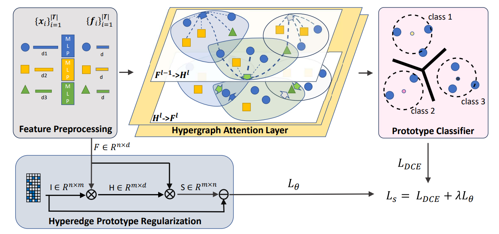

# ProtoHG
Implementation for paper: Prototype-Enhanced Hypergraph Learning for Heterogeneous Information Networks.  International conference of Multimedia Modelling 2024
https://arxiv.org/pdf/2309.13092.pdf

## Pipeline
<div align=center>

</div>

## Requirements
The variety and complexity of relations in multimedia data lead to Heterogeneous Information Networks (HINs). Capturing the semantics from such networks requires approaches capable of utilizing the full richness of the HINs. Existing methods for modeling HINs employ techniques originally designed for graph neural networks, and HINs decomposition analysis, like using manually predefined metapaths. In this paper, we introduce a novel prototype-enhanced hypergraph learning approach for node classification in HINs. Using hypergraphs instead of graphs, our method captures higher-order relationships among nodes and extracts semantic information without relying on metapaths. Our method leverages the power of prototypes to improve the robustness of the hypergraph learning process and creates the potential to provide human-interpretable insights into the underlying network structure. Extensive experiments on three real-world HINs demonstrate the effectiveness of our method.


## Requirements
2.1 Main python packages and their version
- Python3
- torch                         1.13.1+cu116
- torch-scatter                 2.1.1+pt113cu117
- torch-sparse                  0.6.17+pt113cu117

## Hardware
- 1 NVIDIA A100

## Datasets
ACM, DBLP, WikiArt

## Structure
```
|- data_hete
    |- ACM_hete
    |- DBLP_hete
    |- wikiart_hete
|- model
    networks.py
    layer.py
main_transformer.py
utils.py
```

## Training

taking ACM dataset as an example:
python main_transformer.py --data HGB_hyper_data --dataset ACM_hete --num_hidden 64 --n_head 4 --n_layer 3 --reg_p 1e-6 --loss sim --lr 0.01 

## Acknowledgement
This repo is based on [HyperSage](https://github.com/worring/HyperMessage) and [HEGEL: Hpyergraph Transformer](https://github.com/hpzhang94/hegel_sum), thanks for their excellent work.


If you find this repo useful, please consider cite: 
```
@misc{wang2023prototypeenhanced,
      title={Prototype-Enhanced Hypergraph Learning for Heterogeneous Information Networks}, 
      author={Shuai Wang and Jiayi Shen and Athanasios Efthymiou and Stevan Rudinac and Monika Kackovic and Nachoem Wijnberg and Marcel Worring},
      year={2023},
      eprint={2309.13092},
      archivePrefix={arXiv},
      primaryClass={cs.LG}
}
```


""""""""""""""""""""""""""""""""""""""""""""""""""""""""""""""""""""""""""""""""""""""""""""""

# NFormer

Implementation of NFormer: Robust Person Re-identification with Neighbor Transformer. CVPR2022

## Pipeline
<div align=center>

</div>

## Requirements
 - Python3
 - pytorch>=0.4
 - torchvision
 - pytorch-ignite=0.1.2 (Note: V0.2.0 may result in an error)
 - yacs
## Hardware
 - 1 NVIDIA 3090 Ti

## Dataset
Create a directory to store reid datasets under this repo or outside this repo. Set your path to the root of the dataset in `config/defaults.py` or set in scripts `Experiment-all_tricks-tri_center-market.sh` and `Test-all_tricks-tri_center-feat_after_bn-cos-market.sh`.
#### Market1501
* Download dataset to `data/` from https://zheng-lab.cecs.anu.edu.au/Project/project_reid.html
* Extract dataset and rename to `market1501`. The data structure would like:

```bash
|-  data
    |-  market1501 # this folder contains 6 files.
        |-  bounding_box_test/
        |-  bounding_box_train/
              ......
```


## Training
download the pretrained [resnet50](https://download.pytorch.org/models/resnet50-19c8e357.pth) model and set the path at [line3](configs/softmax_triplet_with_center.yml)

run `Experiment-all_tricks-tri_center-market.sh` to train NFormer on Market-1501 dataset
```
sh Experiment-all_tricks-tri_center-market.sh
```
or 
```
python3 tools/train.py --config_file='configs/softmax_triplet_with_center.yml' MODEL.DEVICE_ID "('0')" DATASETS.NAMES "('market1501')" DATASETS.ROOT_DIR "('/home/haochen/workspace/project/NFORMER/')" OUTPUT_DIR "('work_dirs')"
```

## Evaluation
run `Test-all_tricks-tri_center-feat_after_bn-cos-market.sh` to evaluate NFormer on Market-1501 dataset. Change `TEST.TEST_NFORMER` to determine test for NFormer (`'yes'`) or CNNEncoder (`'no'`).

```
sh Test-all_tricks-tri_center-feat_after_bn-cos-market.sh
```
or 
```
python3 tools/test.py --config_file='configs/softmax_triplet_with_center.yml' MODEL.DEVICE_ID "('0')" DATASETS.NAMES "('market1501')" DATASETS.ROOT_DIR "('/home/haochen/workspace/project/NFORMER')" MODEL.PRETRAIN_CHOICE "('self')" TEST.WEIGHT "('test/nformer_model.pth')" TEST.TEST_NFORMER "('no')"
```

 

